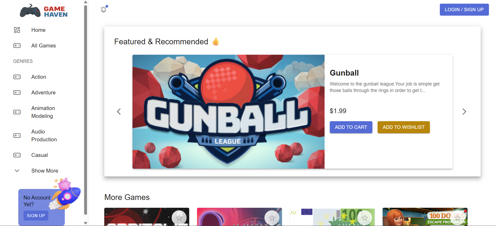
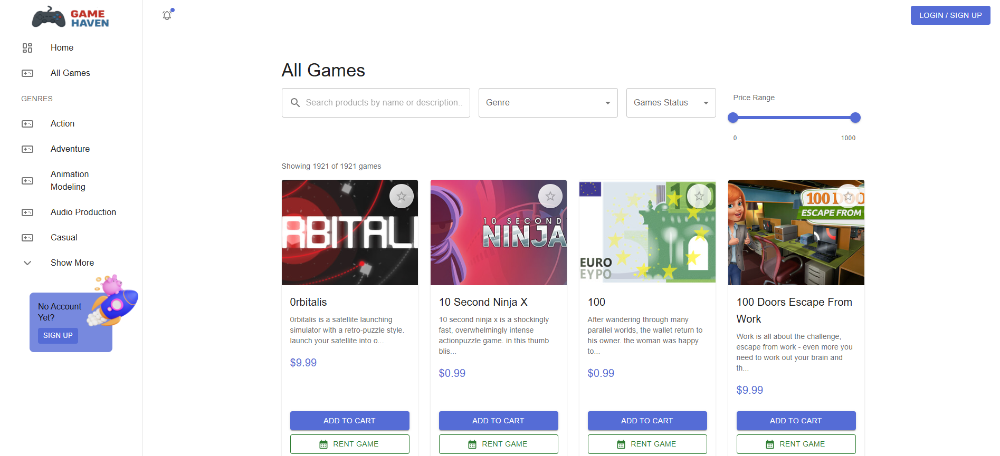
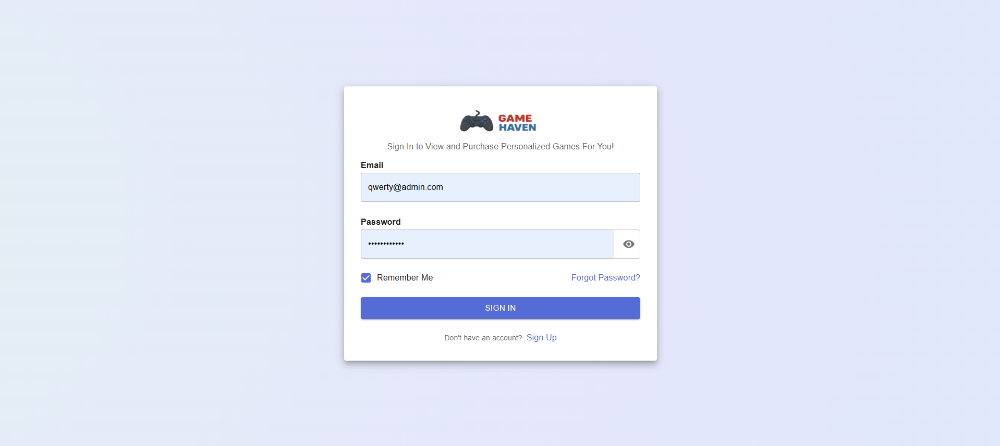
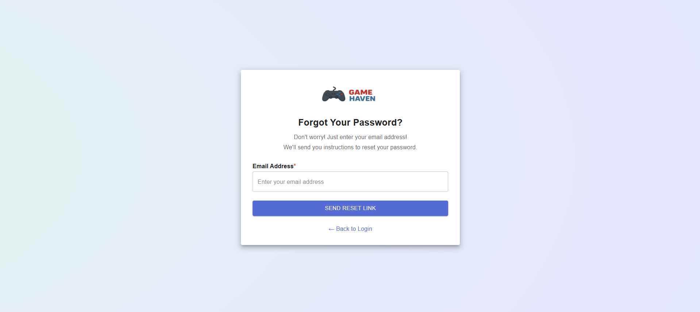
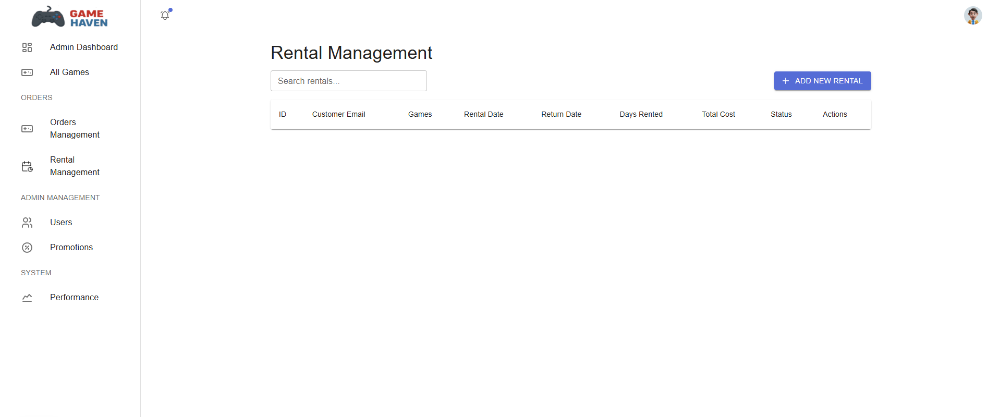
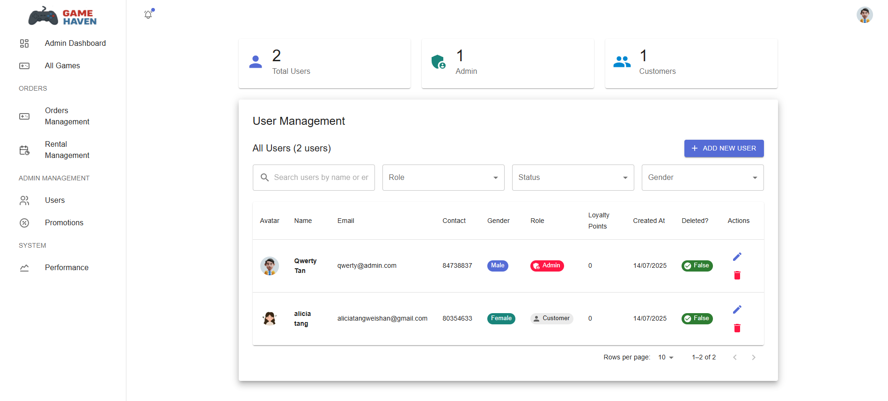
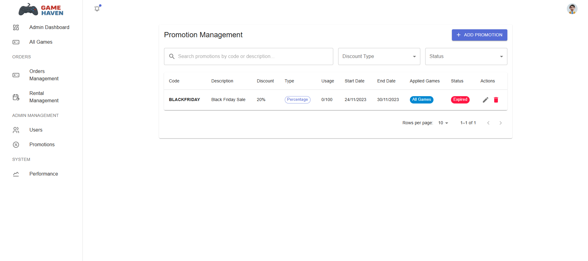

# Game Haven – Hybrid Game Collection Store

## Skill Stash

[](https://nextjs.org/)

<div >
<a href="https://nextjs.org/">
 
</a>
<a href="https://mui.com/material-ui/">
 
</a>
<a href="https://www.typescriptlang.org/">
 
</a>
<a href="https://redux.js.org/">
 
</a>
 
 
</div>

## Database Comparison 🌓

| Relational DB (MySQL)                                                                 | NoSQL (MongoDB)                                                     |
| ------------------------------------------------------------------------------------- | ------------------------------------------------------------------- |
| User Accounts<br />Game Genres<br />Promotions<br />Order Records<br />Rental Records | Ratings<br />Reviews<br />Recommendations<br />Performance Analysis |

##### Our Game Store Landing Page & All Games Page

<div style="display: flex; gap: 10px;">

  
  

</div>

##### Login & Sign Up Pages

<div style="display: flex; gap: 10px;">

  
  

</div>

##### Forgot Password & Rental Management

<div style="display: flex;">
  
  
</div>

##### User Management & Promotion Management

<div style="display: flex;">
  
  
</div>

## Getting Started

1. Copy the codes in `.env.example` and **create** a `.env` file in the same directory.
2. Modify the username and password according to your **own** mysql (workbench) account.
3. Check that you have node.js installed by running:

> npm run dev

**→** If there is an error, head to [https://nodejs.org/en/download]() .

4. Run this command again `npm run dev` after installation.
5. Enter this command at your command prompt terminal if there's an error:

> npm install

OR if *`npm install`* cannot work, run this:

> npm install next react react-dom

6. Lastly, run the development server:

```bash
npm run dev
# or
yarn dev
# or
pnpm dev
```

* If there is any errors regarding sql, head to download into your environment:

  [https://dev.mysql.com/downloads/installer/]()

Open [http://localhost:3000](http://localhost:3000) with your browser to see the result.

## Meet Our Team Developers:

1. Alicia
2. Lea
3. Ryson
4. Tushar
5. Yale
6. Nabil
